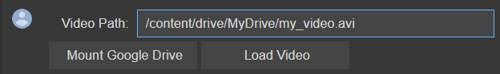

# Jupyter Notebook interativo para cálculo de parâmetros hemodinâmicos de vídeos de coração do inseto

Autores: [Felipe Hiroshi Kano Inazumi](mailto:f215696@dac.unicamp.br),
[Nelly Catherine Barbosa Calderon](mailto:n160942@dac.unicamp.br), 
[Adriano Santana](mailto:adriano.rsantana@gmail.com),
[Rosana Almada Bassani](mailto:arbassani@unicamp.br), 
[José Wilson Magalhães Bassani](bassani@unicamp.br)

## Execução Online  

 A execução online do projeto pode ser feita através de um abiente Google Colab 

## Instalação e Pré-Requisitos

 Como o software será executado de forma totalemte online em um abiente criado na plataforma Google Colab, então não é necessário a instalação de nenhuma biblioteca na máquina local

 Contudo, o vídeo a ser analisado deve ser enviado na nuvem para que possa ser acessado pelo ambiente Google Colab. Os procedimentos para envio do vídeo estão descritos no item abaixo

## Como Executar

 Faça a abertura do arquivo Google Colab no navegador desejado clicando no link 
  

 

 Execute o arquivo do Google Colab clicando no botão 
 (ou clique em Ambiente de Execução -> Executar Tudo) e em seguida, será apresentado um menu inicial

Para que o vídeo possa ser lido pelo software, coloque o caminho do vídeo no campo "Video Path". Dessa forma, é necessário que o vídeo a ser analisado seja enviado na nuvem. Os processos para envio são descritos abaixo

- ### Envio do Vídeo no Google Drive

Faça login em seu *[Google Drive](https://drive.google.com/drive/u/0/my-drive)* e faça o envio do vídeo a ser analisado.

Se o vídeo estiver enviado na raíz do Google Drive, inisra o seguinte caminho 

- ### Envio do Vídeo no Google Colab

  

## Referências

1.	Virtanen P, Gommers R, Oliphant TE, Haberland M, Reddy T, Cournapeau D, et al. SciPy 1.0: Fundamental Algorithms for Scientific Computing in Python. Nat Methods. 2020;17:261–72. 
2.	Harris CR, Millman KJ, der Walt SJ van, Gommers R, Virtanen P, David Cournapeau, et al. Array programming with NumPy. Nature [Internet]. 2020 set;585(7825):357–62. Available from: https://doi.org/10.1038/s41586-020-2649-2
3.	pandas development team T. pandas-dev/pandas: Pandas [Internet]. Zenodo; 2020. Available from: https://doi.org/10.5281/zenodo.3509134
4.	Bradski G. The OpenCV Library. Dr Dobb’s Journal of Software Tools. 2000; 
5.	Hunter JD. Matplotlib: A 2D graphics environment. Comput Sci Eng. 2007;9(3):90–5. 